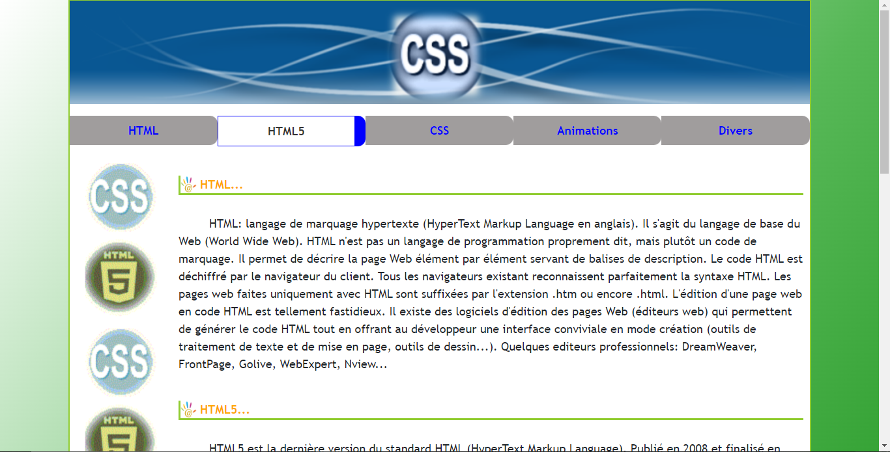
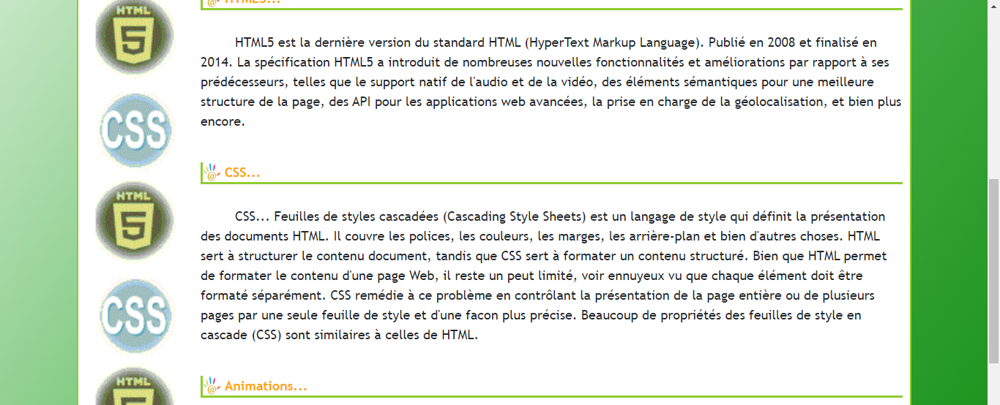
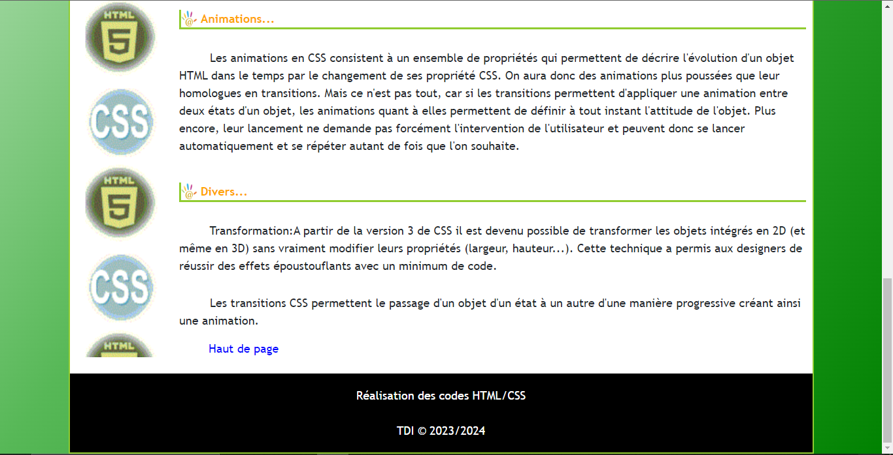

## Description
This is a beginner-friendly web development exploration, integrating HTML, HTML5, CSS, and Bootstrap to create a visually engaging and responsive webpage. The CSS code within this repository defines a clean and responsive design, featuring a gradient background, distinct container borders, flexible content layout using flexbox, and stylistic enhancements such as rounded buttons with interactive hover effects.
## Screenshots

